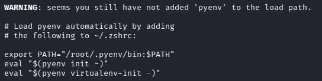

# Workstation Setup

## Installing the Operating System

* Download the ISO for the operating system of your choice
  * [Kali ](https://www.kali.org/downloads/)is the most widely used
  * [Parrot](https://parrotlinux.org/download/) is lighter and has more tools
* Verify the sha256 hashsum of the file using one of the following methods



```aspnet
Get-FileHash \path\to\file
```



```bash
sha256sum <file>
```



* Open 7-Zip and browse to the file
* Right click the file -&gt; CRC -&gt; SHA-256



* Use the New Virtual Machine Wizard in VMware Workstation to create a VM from the ISO file
* Boot the VM and follow the interactive installer using the following settings:
  * Use the entire virtual disk
  * Install on a single partition
  * No LVM
  * No encrypted volumes


These installer settings are ideal for a virtual machine that will be wiped or rolled back on a regular basis. For a semi-permanent bare-metal installation, encrypted volumes should be used and LVM is preferred.


## Enabling SSH Access

SSH access from the host may seem unnecessary with the ability to interact directly with the VM, but using an SSH client is lower latency and saves resources if you run your VM in headless mode.

### Option 1: Quick, Insecure, Ephemeral

```bash
#install openssh server
apt install -y openssh-server

#configure to allow root login
echo "PermitRootLogin yes" >> /etc/ssh/sshd_config

#start the ssh service
systemctl start ssh.socket
```

### Option 2: Permanent, More Secure

```bash
#install openssh server
apt install -y openssh-server

#
```

## Configuring Python Environment

Many tools and exploits are written in Python, and there is no way to know exactly which version you are going to need. The middle of an engagement is the wrong time to be installing different versions of Python. Instead, setup _pyenv_ from the beginning to allow easy switching between versions.

### Install Pyenv

Unlike Kali's package manager apt, pyenv installs python by building it from the source. This means you need to install the dependencies for building Python.

```bash
sudo apt install -y make build-essential libssl-dev zlib1g-dev \
libbz2-dev libreadline-dev libsqlite3-dev wget curl llvm libncurses5-dev \
libncursesw5-dev xz-utils tk-dev libffi-dev liblzma-dev python3-openssl
```

Next, download and run the automated installer.

```bash
curl https://pyenv.run | zsh
```


ZSH has been the default shell since 2020.4. If you are using a different shell, such as bash, update the command to pipe the script to the correct shell. An easy way to find which shell you are running is `ps -p $$`


At the end of the script there will be a warning indicating that pyenv has not been added to the load path. Follow the instructions given to ensure pyenv is able to start automatically. The instructions for each shell will be different.



Finally, restart your terminal or reload the shell with `exec "$SHELL"`

### Using Pyenv

Use `pyenv install [version]` to add a new version of python. You can see all available versions with `pyenv install --list`. The list is long, so filter with grep to help find what you are looking for.


